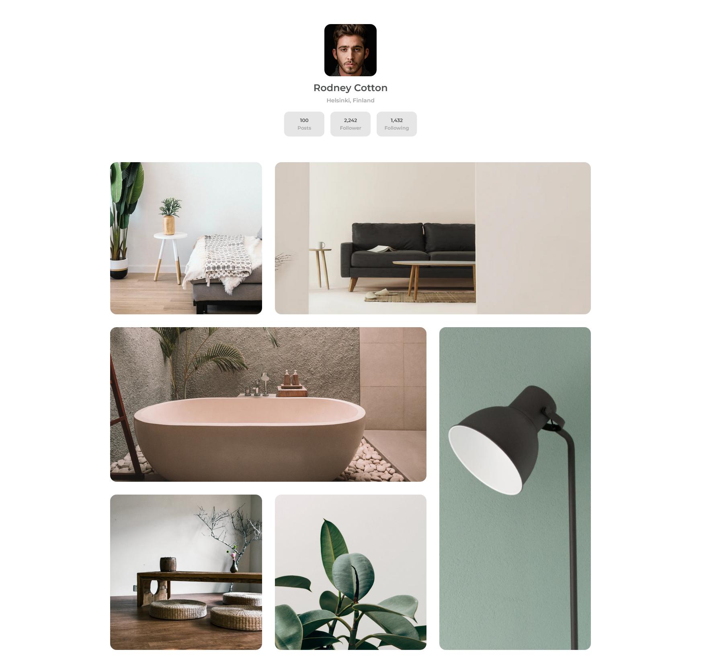

# Dev Challenges - Gallery

This is a solution to the [Gallery challenge on Dev Challenges](https://devchallenges.io/challenges/gcbWLxG6wdennelX7b8I). Challenge: Create a static page with HTML and CSS following the designs.
Fulfill user stories below:

- User story: I can see a page following the given design

## Table of contents

- [Overview](#overview)
  - [The challenge](#the-challenge)
  - [Screenshot](#screenshot)
  - [Links](#links)
- [My process](#my-process)
  - [Built with](#built-with)
- [Author](#author)

## Overview

### Screenshot

### Links

- Solution URL: [Repo](https://github.com/karinaestaba/gallery.git)
- Live Site URL: [Demo](https://karinaestaba.github.io/gallery)

## My process

### Built with

- Semantic HTML5 markup
- CSS custom properties
- Flexbox, CSS GRID
- Sass

## Author

- Website - [Karina Estaba]
- Dev Challenges - [@karinaestaba](https://devchallenges.io/portfolio/karinaestaba)
